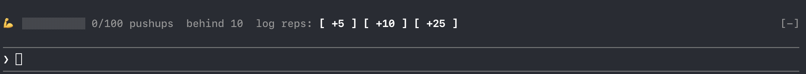

# ❚█═TERMINAL-GYM═█❚

**Your agent put in the reps. You next.**

A Claude Code mod for a daily bodyweight rep goal. While Claude works, you train: log sets from a band above your prompt, keep a streak, and let strict mode spread the reps through your day.

```sh
claude plugin marketplace add DrumAndCode/terminal-gym && claude plugin install terminal-gym@terminal-gym
```

Start a new Claude Code session and the welcome band appears above your prompt.



## Demo (40 seconds)
https://github.com/user-attachments/assets/14373c7e-ad8a-4f92-812b-c93c3201b1b3

## What you get

- **Tracker band** above the prompt: `💪 ▓▓▓▓▓▓░░░░ 60/100 pushups  next set 10:53  log reps: [ +5 ] [ +10 ] [ +25 ]  🔥3d`. It's grey at 0, then red, yellow and green as you close in on the goal.
- **Walkthrough**: three steps on first run: what the mod does, pick your program, how streaks and the scoreboard work.
- **Set reminders**: a toast when each set comes due.
- **Long-turn nudges** (easy mode): when Claude works past 30 seconds, a toast and the spinner suggest a set.
- **Strict mode**: today's goal is split into sets spread over your day. Fall behind and your prompts wait until you catch up.
- **Scoreboard** (`/fit score`): an ASCII barbell (in the terminal), your streak, a 28-day grid and the last week by exercise, with today marked.
- **Streaks**: count every day you hit your goal, for as long as you keep it going.

## How a strict day works

Strict mode spreads today's goal into evenly spaced sets over a training window (8 hours by default) that starts with your first prompt of the day. With 100 pushups:

| When | What happens |
|---|---|
| First prompt (say 9:00) | The day starts and the opening set is due. Your prompt waits: *"Behind pace: 10 pushups to catch up (10/100 due by now). /fit 10 to log."* |
| After `/fit 10` | You're through. The band reads `next set 09:53` |
| 9:53 | Toast: *"⏱ Set due: 10 pushups. 20/100 by now."* Your next prompt waits until you log it |
| …about every 53 minutes… | Ten sets in all, the last due 8 hours after your first prompt |
| Goal done, or a rest day | Nothing waits |

Only prompts you type can be held. Background tasks, `/loop` runs, messages from other sessions and slash commands like `/fit 10` always go through. Prompts before 5am count as the night before, so a late night never leaves you a wall of overdue sets in the morning.

Easy mode (the default) shows the same schedule on the band and the same reminders, but never holds a prompt.

## Commands

| Command | Does |
|---|---|
| `/fit` | today's progress, pace and streak |
| `/fit 20` | log 20 reps |
| `/fit set 80` | fix today's count |
| `/fit reset` | today back to 0 |
| `/fit swap [exercise]` | switch today's exercise: the next in your program, or the one you name |
| `/fit rest` | rest day: no sets due, breaks your streak |
| `/fit rest off` | undo today's rest day (or press **Train today** on the band) |
| `/fit score` | scoreboard: streak, grid and the last week (run again or press Esc to close) |
| `/fit program` | pick your program (the walkthrough) |
| `/fit strict` / `/fit easy` | strict mode on / off |
| `/fit rules` | house rules |
| `/fit start` | replay the welcome |
| `/fit hide` | close panels |

## Settings

In `/config`, under terminal-gym:

| Setting | Default | What it does |
|---|---|---|
| Strict mode | off | Hold typed prompts while you're behind pace |
| Training window | 8 hours | How long after your first prompt the day's sets are spread over |
| Set size | auto | Reps per set; auto is a tenth of the goal, rounded to fives |
| Long-turn nudges | on | Easy mode: suggest a set when a turn runs long |
| Nudge after | 30 seconds | How long a turn runs before the nudge |
| Reps per nudge | 10 | The set the nudge suggests |
| Spinner takeover | on | Easy mode: show the suggested set in the spinner |
| Quick-log band | on | Show the tracker band above the prompt |

## Privacy and data

The mod makes no network calls and adds no hidden context for the model. `/fit` replies appear in your conversation like any slash command's output, so Claude can see them. Everything else stays on your machine: a few values in the mod's own store (see below), and your data in `~/.claude/fitness`:

- `routine.json`: the plan per weekday, for example `{ "mon": { "exercise": "pushups", "goal": 100 } }`, with an optional `"unit": "s"` for timed exercises. Edit it for a custom program.
- `log/YYYY-MM-DD`: that day's count.
- `log/YYYY-MM-DD.skip`: a rest day. If it contains `off`, the rest day was undone.
- `log/YYYY-MM-DD.swap`: that day's exercise after `/fit swap`, in the same shape as a routine day.

## What it does inside Claude Code

A mod runs inside Claude Code, so here is everything Terminal Gym touches:

- **Files it writes:** only its own data in `~/.claude/fitness`: the routine, the daily logs listed above, and `routine.json.bak` (a copy of your custom routine, made before the walkthrough replaces it). It never writes settings files, instructions, build or start-up files directly.
- **Its own store:** a few values in the mod's per-plugin store inside Claude Code: today's start time, the streak cache, and whether you've seen the welcome.
- **Settings it changes:** `/fit strict` and `/fit easy` turn its own *Strict mode* setting (`terminal-gym.strict`) on and off. That's the only setting it changes. It sets no environment variables; it reads `HOME` to find `~/.claude/fitness`.
- **Permissions:** it never approves or denies a tool call, never changes your permission mode, and never runs a model or a process.
- **Events it hooks:**
  - `prompt.submit`: in strict mode, holds a prompt you typed while you're behind pace and puts its text back in the prompt box. Easy mode lets everything through. Prompts from other sources are never touched.
  - `command.run`: answers its own `/fit` command, and nothing else.
  - `session.start` and the SessionStart event after `/clear` or `/resume`: load today's state and register `/fit`. The event passes through unchanged.
  - `turn.start` and `turn.complete`: time the easy-mode nudge and refresh the band.
  - `ui.render`: draws the band, the scoreboard, the house rules and the walkthrough, and (easy mode) the suggested set in the spinner.

## Requirements

Claude Code 2.1.288 or newer. The band and panes draw in the terminal and the Desktop app's Code tab. In the VS Code chat panel and `claude -p`, `/fit` still works but nothing is drawn. Mods are early access, so the API can change between Claude Code releases.

Update with `claude plugin update terminal-gym@terminal-gym`. From inside a chat, you can also install with `/plugin install terminal-gym --marketplace DrumAndCode/terminal-gym`.

## Contributing

Issues and PRs welcome. Keep changes small and include a test.

```sh
claude --plugin-dir .          # load your checkout for one session
claude plugin validate --strict .
claude plugin test .
```

`claude plugin test` runs `tests/*.test.tsx` against the engine itself. Once the mod has loaded, `tsc -p .` type-checks it against the engine's types in `.claude-plugin/types/`.

## License

MIT
